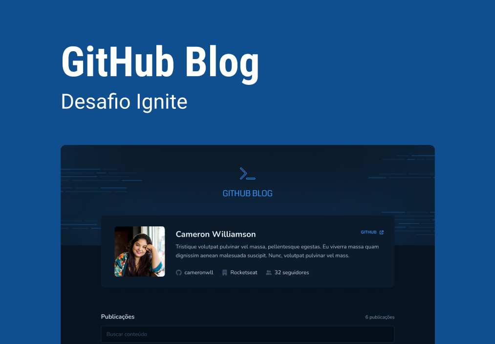

# 📝 Github Blog

The Github Blog is an innovative application that transforms GitHub repositories into dynamic blogs. By leveraging the GitHub API, this app fetches issues from a specific repository and displays them as blog posts, along with the user's profile data. Perfect for developers looking to share their ideas and project updates directly from their GitHub, the Github Blog integrates technology and convenience for a unique reading and publishing experience.

## 🖌️ Layout in Figma

Check out clicking here 👉 [Layout](https://www.figma.com/design/YP87nyXprPixCN4JrJ1dBD/GitHub-Blog-(Community)?node-id=405-574&t=rL9oigjGfsPIwD8R-0)

## 🌟 With Github Blog you can:

- [x] Fetch issues from a specific GitHub repository;
- [x] Display issues as blog posts;
- [x] Retrieve and display your GitHub profile data;
- [x] Showcase project updates directly from your GitHub;
- [x] Share ideas seamlessly with your audience;
- [x] Enhance your blog with real-time issue updates;
- [x] Keep your blog content synchronized with your GitHub repository;
- [x] Provide readers with insights into your development process.